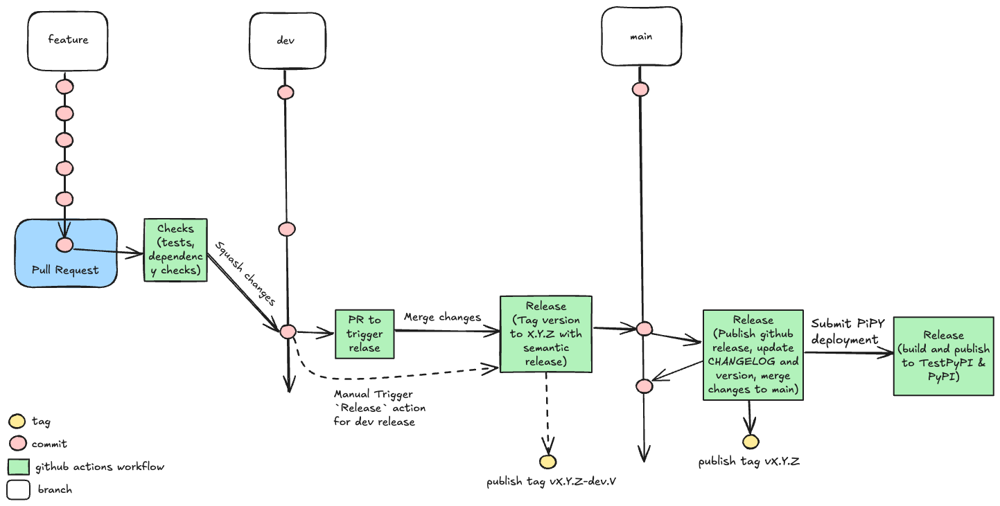

# Contributing guidelines

## One-time configuration

The steps in this section only ever need to be done once on any particular system.

For Google Cloud configuration:

1. Install Google Cloud SDK: https://cloud.google.com/sdk/docs/install.

1. Log in to your work Google Account: run `gcloud auth login` and follow instructions.

1. Obtain Google application credentials: run `gcloud auth application-default login` and follow instructions.

Check that you have the `make` utility installed, and if not (which is unlikely), install it using your system package manager.

!!! note "Java support"

    Check that you have `java` installed. To be able to use all features including hail support use java 11 (for handling multiple java versions, consider using [`sdkman`](https://sdkman.io/)).

## Environment configuration

Run `make setup-dev` to install/update the necessary packages (including required python version for development) and activate the development environment. You need to do it just once.

It is recommended to use VS Code as an IDE for development.

## How to create gentropy step

All gentropy steps can be invoked after successful environment configuration by running

```bash
uv run gentropy step=<step_name>
```

1. Create a new step config in the `src/gentropy/config.py` that inherits from `StepConfig` class.

2. Register new step configuration to `ConfigStore`.

3. Create a step class that holds the business logic in new file in the `src/gentropy/{your_step_name}.py`.

## Contributing checklist

When making changes, and especially when implementing a new module or feature, it's essential to ensure that all relevant sections of the code base are modified.

- [ ] Run `make check`. This will run the linter and formatter to ensure that the code is compliant with the project conventions.
- [ ] Develop unit tests for your code and run `make test`. This will run all unit tests in the repository, including the examples appended in the docstrings of some methods.
- [ ] Update the configuration if necessary.
- [ ] Update the documentation and check it with `make build-documentation`. This will start a local server to browse it (URL will be printed, usually `http://127.0.0.1:8000/`)

For more details on each of these steps, see the sections below.

### Documentation

- If during development you had a question which wasn't covered in the documentation, and someone explained it to you, add it to the documentation. The same applies if you encountered any instructions in the documentation which were obsolete or incorrect.
- Documentation autogeneration expressions start with `:::`. They will automatically generate sections of the documentation based on class and method docstrings. Be sure to update them for:
  - Datasource main page, for example: `docs/python_api/datasources/finngen/_finngen.md`
  - Dataset definitions, for example: `docs/python_api/datasources/finngen/study_index.md`
  - Step definition, for example: `docs/python_api/steps/finngen_sumstat_preprocess.md`

### Configuration

- step default configuration in the `src/gentropy/config/` `StepConfig` derived classes.

### Classes

- Datasource init, for example: `src/gentropy/datasource/finngen/__init__.py`
- Dataset classes, for example: `src/gentropy/datasource/finngen/study_index.py` → `FinnGenStudyIndex`
- Step main running class, for example: `src/gentropy/finngen_sumstat_preprocess.py`

### Tests

- Test study fixture in `tests/conftest.py`, for example: `mock_study_index_finngen` in that module
- Test sample data, for example: `tests/gentropy/data_samples/finngen_studies_sample.json`
- Test definition, for example: `tests/dataset/test_study_index.py` → `test_study_index_finngen_creation`)

### Airflow dags

- Upstream of version 2.0.0 airflow orchestration layer was moved to the [orchestration repository](https://github.com/opentargets/orchestration)

### Support for python versions

As of version 2.1.X gentropy supports multiple python versions. To ensure compatibility with all supported versions, unit tests are run for each of the minor python release from 3.10 to 3.12. Make sure your changes are compatible with all supported versions.

### Development process

The development follows simplified Git Flow process that includes usage of

- `dev` (development branch)
- `feature` branches
- `main` (production branch)

The development starts with creating new `feature` branch based on the `dev` branch. Once the feature is ready, the Pull Request for the `dev` branch is created and CI/CD Checks are performed to ensure that the code is compliant with the project conventions. Once the PR is approved, the feature branch is merged into the `dev` branch.

#### Development releases

One can create the dev release tagged by `vX.Y.Z-dev.V` tag. This release will not trigger the CI/CD pipeline to publish the package to the PyPi repository. The release is done by triggering the `Release` GitHub action.

#### Production releases

Once per week, the `Trigger PR for release` github action creates a Pull Request from `dev` to `main` branch, when the PR is approved, the `Release` GitHub action is triggered to create a production release tagged by `vX.Y.Z` tag. This release triggers the CI/CD pipeline to publish the package to the _TestPyPi_ repository. If it is successful, then the actual deployment to the _PyPI_ repository is done. The deployment to the PyPi repository must be verified by the gentropy maintainer.

Below you can find a simplified diagram of the development process.

<div align="center">
  
</div>
