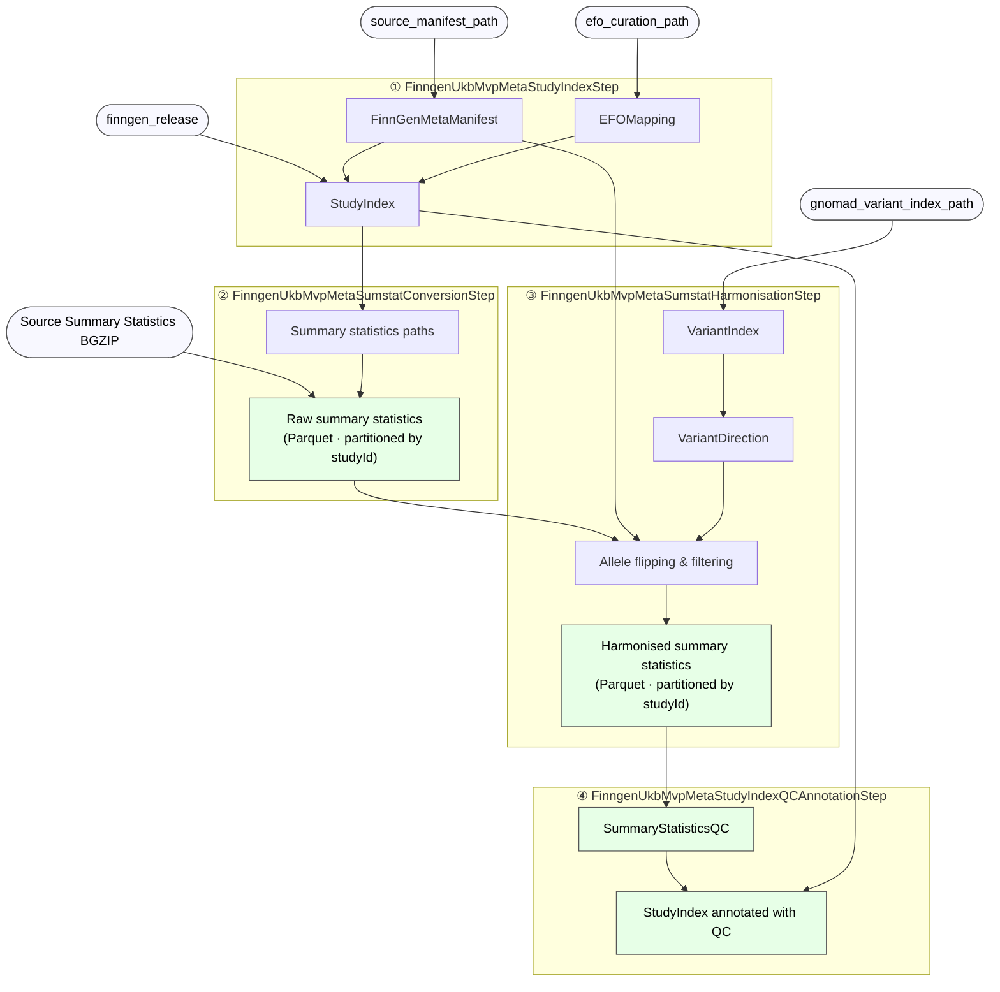

## Pipeline overview

The ingestion pipeline consists of four steps that must be executed in order:

1. **`FinngenUkbMvpMetaStudyIndexStep`** — builds `StudyIndex` from the manifest and EFO curation.
2. **`FinngenUkbMvpMetaSumstatConversionStep`** — converts BGZIP summary statistics to Parquet, partitioned by `studyId`.
3. **`FinngenUkbMvpMetaSumstatHarmonisationStep`** — harmonises summary statistics using gnomAD allele directions.
4. **`FinngenUkbMvpMetaStudyIndexQCAnnotationStep`** — runs summary-statistics QC and annotates the study index.

`FinngenUkbMvpMetaSummaryStatisticsIngestionStep` is a convenience façade that chains all four steps.

??? tip "Inputs" - [x] `source_manifest_path`: manifest with summary statistics file paths and study metadata. - [x] `efo_curation_path`: EFO curation file for disease mapping. - [x] `gnomad_variant_index_path`: gnomAD variant index used for allele-flip direction. - [x] `finngen_release`: FinnGen release identifier used to filter EFO mappings (default `"R12"`).

??? tip "Outputs" - [x] Raw summary statistics in Parquet format, partitioned by `studyId`. - [x] Harmonised summary statistics in Parquet format, partitioned by `studyId`. - [x] Summary statistics QC results in Parquet format. - [x] Study index in Parquet format (updated with QC flags).

## Steps API

::: gentropy.finngen_ukb_mvp_meta.FinngenUkbMvpMetaSummaryStatisticsIngestionStep

### Individual steps

::: gentropy.finngen_ukb_mvp_meta.FinngenUkbMvpMetaStudyIndexStep

::: gentropy.finngen_ukb_mvp_meta.FinngenUkbMvpMetaSumstatConversionStep

::: gentropy.finngen_ukb_mvp_meta.FinngenUkbMvpMetaSumstatHarmonisationStep

::: gentropy.finngen_ukb_mvp_meta.FinngenUkbMvpMetaStudyIndexQCAnnotationStep
